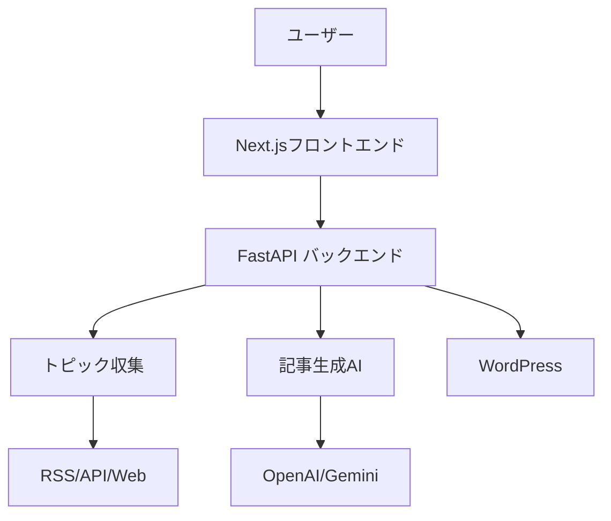

# 🚀 暗号通貨記事自動生成システム


AI駆動の暗号通貨記事自動生成システム。最新のトピックを収集し、高品質な記事を自動生成してWordPressに公開します。

## 🚀 主な機能

### ✅ 実装済み

#### バックエンド（Python + FastAPI）
- **トピック自動収集**: RSS フィード（国内外メディア）、価格データから自動収集
- **AI記事生成**: OpenAI GPT-4 / Gemini を使用した高品質な記事生成
- **ファクトチェック**: 生成された記事の事実確認機能
- **WordPress連携**: 生成記事の自動投稿（下書きモード）
- **パイプライン管理**: 全プロセスの自動化と監視
- **REST API**: フロントエンドとの連携用API（FastAPI）

#### フロントエンド（Next.js + TypeScript）
- **ダッシュボード**: システム状況とリアルタイム統計表示
- **トピック管理**: 50件以上のトピック表示、フィルタリング、優先度設定
- **記事生成フォーム**: 詳細なカスタマイズオプション付き記事生成
- **記事プレビュー**: 生成記事の確認・編集・WordPress投稿
- **統合設定画面**: API設定、WordPress連携、収集源管理、システム監視、ログ表示
- **ソース管理**: RSS/API/Webサイトの追加・テスト・管理
- **システム監視**: CPU/メモリ使用率、パフォーマンスメトリクス表示
- **レスポンシブデザイン**: Tailwind CSS使用のモダンダークテーマUI

### 🔄 開発予定
- **高度なスケジューリング**: 時間指定での自動実行
- **分析ダッシュボード**: 記事パフォーマンスの詳細分析
- **マルチユーザー対応**: チーム向け権限管理
- **プラグイン機能**: カスタムデータソース・記事タイプの追加

## 📁 プロジェクト構成

```
crypto-article-system/
├── src/                                    # Pythonソースコード
│   ├── crypto_article_generator_mvp.py     # 記事生成エンジン
│   ├── topic_collector.py                  # ネタ収集システム（70件のモックデータ）
│   ├── fact_checker.py                     # ファクトチェック機能
│   ├── wordpress_publisher.py              # WordPress自動投稿
│   ├── article_pipeline.py                 # 統合パイプライン
│   └── config_manager.py                   # セキュア設定管理（暗号化対応）
├── crypto-article-system/                  # Next.jsフロントエンド
│   ├── src/
│   │   ├── app/                            # Next.js App Router
│   │   ├── components/                     # Reactコンポーネント
│   │   └── lib/                            # APIクライアント・ユーティリティ
│   ├── package.json
│   └── tailwind.config.ts
├── api_server.py                           # FastAPI バックエンドサーバー
├── output/                                 # 生成された記事の出力先
├── scripts/                                # 実行スクリプト
├── .env                                    # 環境変数設定
├── requirements.txt                        # Python依存関係
└── README.md                               # このファイル
```

## 🚀 クイックスタート

### 1. 環境準備

```bash
# プロジェクトディレクトリに移動
cd crypto-article-system

# Python仮想環境を作成
python -m venv venv
source venv/bin/activate  # Mac/Linux
# venv\Scripts\activate   # Windows

# Python依存関係をインストール
pip install -r requirements.txt

# フロントエンド依存関係をインストール
cd crypto-article-system
npm install
cd ..
```

### 2. システム起動

#### 開発環境での起動

```bash
# スクリプトで簡単起動
./scripts/start_dev.sh

# または手動で起動
# 1. バックエンドAPI起動
PYTHONPATH=. python api_server.py &

# 2. フロントエンド起動
cd crypto-article-system
npm run dev
```

起動後のアクセス先：
- **フロントエンド**: http://localhost:3000
- **バックエンドAPI**: http://localhost:8000

### 3. 初回設定

1. フロントエンドのダッシュボードにアクセス
2. 「⚙️ 設定」タブをクリック
3. 「🔑 API設定」で必要なAPIキーを設定：
   - OpenAI APIキー（必須）
   - Gemini APIキー（オプション）
   - CoinMarketCap APIキー（オプション）
4. 「🔗 WordPress」タブでWordPress接続を設定
5. 「🔍 収集源管理」タブでRSS/APIソースを追加
6. 「🔍 接続テスト」で設定を確認
7. 「💾 設定を保存」で保存

## 🎯 主な機能詳細

### 📝 記事生成エンジン
- **6種類の記事タイプ**: 速報、価格分析、技術分析、プロジェクト更新、教育記事、市場概況
- **3段階の深度管理**: 浅い（300-500文字）、中程度（600-1000文字）、深い（1000-1500文字）
- **HTML自動変換**: WordPress投稿用のHTML形式に自動変換
- **複数AI対応**: OpenAI GPT-4、Gemini

### 🔍 ネタ収集システム
- **RSS フィード監視**: 
  - 海外: CoinTelegraph, CoinDesk, Decrypt, Bitcoin Magazine
  - 国内: CoinPost, 仮想通貨Watch
- **価格データ分析**: CoinGecko APIから価格変動を監視
- **トピック優先順位付け**: 重要度スコアに基づく自動ランキング
- **重複除去**: 同じトピックの重複投稿を防止

### ✅ ファクトチェック機能
- **価格データ検証**: リアルタイム価格との照合
- **日付検証**: 日付の妥当性チェック
- **数値検証**: 異常な数値の検出
- **信頼度スコア**: 記事の信頼性を数値化

### 📤 WordPress自動投稿
- **REST API連携**: WordPress REST APIを使用した自動投稿
- **下書き保存**: 公開前の確認が可能
- **カテゴリ・タグ自動設定**: 記事タイプに応じた自動分類
- **メタデータ管理**: 生成情報の記録

## 🖥️ フロントエンド機能

### メインタブ構成（4タブ）
1. **🎯 最新トピック**: 50件のトピック一覧、フィルタリング、記事生成
2. **📝 生成記事**: 記事の確認・編集・WordPress投稿
3. **✨ 記事生成**: 詳細設定での記事生成フォーム
4. **⚙️ 設定**: 統合設定画面（6つのサブタブ）

### 設定サブタブ
- **🔑 API設定**: 各種APIキーの設定と接続テスト
- **🔗 WordPress**: サイト情報とアプリパスワード設定
- **🔍 収集源管理**: RSS/API/Webサイトの追加・管理
- **🔧 トピック管理**: トピックの編集・削除・優先度設定
- **📊 システム監視**: リアルタイムパフォーマンス監視
- **📋 ログ**: システムログの確認

## 📋 API仕様

### バックエンドAPIエンドポイント

| エンドポイント | メソッド | 説明 |
|---------------|---------|------|
| `/api/system/stats` | GET | システム統計情報取得 |
| `/api/system/control` | POST | システムの開始・停止 |
| `/api/topics` | GET | トピック一覧取得（フィルタ・ソート対応） |
| `/api/topics/{id}` | PUT/DELETE | トピックの更新・削除 |
| `/api/articles` | GET | 記事一覧取得 |
| `/api/articles/generate` | POST | 記事生成開始 |
| `/api/articles/{id}` | GET/PUT/DELETE | 記事の取得・更新・削除 |
| `/api/articles/{id}/publish` | POST | WordPress投稿 |
| `/api/settings/config` | GET/POST | API設定の取得・更新 |
| `/api/settings/test-connection` | POST | API接続テスト |
| `/api/sources` | GET/POST | ソース一覧取得・追加 |
| `/api/sources/{id}` | PUT/DELETE | ソースの更新・削除 |
| `/api/sources/{id}/collect` | POST | ソースからトピック収集 |
| `/api/sources/test` | POST | ソースURLのテスト |
| `/api/secure-config` | GET/POST | セキュア設定の取得・更新 |
| `/api/wordpress/config` | GET/POST | WordPress設定の管理 |
| `/api/wordpress/test` | POST | WordPress接続テスト |
| `/api/logs` | GET | システムログ取得 |

## ⚙️ 設定項目

### 環境変数

| 変数名 | 説明 | 必須 |
|--------|------|------|
| `OPENAI_API_KEY` | OpenAI APIキー | ✅ |
| `GEMINI_API_KEY` | Gemini APIキー | - |
| `WORDPRESS_URL` | WordPressサイトURL | - |
| `WORDPRESS_USERNAME` | WordPressユーザー名 | - |
| `WORDPRESS_APP_PASSWORD` | WordPressアプリパスワード | - |
| `COINMARKETCAP_API_KEY` | CoinMarketCap APIキー | - |

### システム設定

| 設定項目 | デフォルト値 | 説明 |
|----------|--------------|------|
| `MAX_ARTICLES_PER_DAY` | 50 | 1日の最大記事生成数 |
| `DEFAULT_ARTICLE_DEPTH` | medium | デフォルト記事深度 |
| `DEFAULT_WORD_COUNT_MIN` | 600 | 最小文字数 |
| `DEFAULT_WORD_COUNT_MAX` | 1000 | 最大文字数 |

## 📊 出力ファイル

生成された記事は `output/` ディレクトリに保存されます：

```
output/
├── articles/                    # 生成された記事
│   ├── 20240126_143022_BTC_BREAKING_NEWS.html
│   ├── 20240126_143022_BTC_BREAKING_NEWS_meta.json
│   └── published/               # 投稿済み記事
└── logs/                        # ログファイル
    └── article_pipeline.log
```

## 🔧 開発・カスタマイズ

### 技術スタック

#### バックエンド
- **Python 3.8+**
- **FastAPI**: REST API フレームワーク
- **OpenAI**: 記事生成
- **requests**: HTTP通信
- **feedparser**: RSS解析

#### フロントエンド
- **Next.js 15**: React フレームワーク
- **TypeScript**: 型安全性
- **Tailwind CSS**: スタイリング
- **Radix UI**: UIコンポーネント

### 新しい記事タイプの追加

`src/crypto_article_generator_mvp.py` の `ArticleType` に新しいタイプを追加：

```python
class ArticleType(Enum):
    NEW_TYPE = "new_type"
```

### 新しいデータソースの追加

`src/topic_collector.py` に新しいコレクタークラスを作成：

```python
class NewDataCollector:
    def collect(self) -> List[CollectedTopic]:
        # 実装
        pass
```

## 🛠️ トラブルシューティング

### よくある問題

1. **APIキーエラー**
   - 設定画面でAPIキーを確認
   - 接続テストを実行

2. **WordPress接続エラー**
   - URLの形式を確認（https://example.com）
   - アプリケーションパスワードの設定を確認

3. **フロントエンド起動エラー**
   - `npm install` の再実行
   - Node.js バージョンの確認（推奨: 18+）

4. **バックエンド起動エラー**
   - 仮想環境の有効化を確認
   - `pip install -r requirements.txt` の再実行

## 🏗️ アーキテクチャ



## 🔒 セキュリティ

- **APIキー暗号化**: Fernet暗号化によるセキュア保存
- **環境変数分離**: センシティブ情報の環境変数管理
- **CORS設定**: 適切なCORSポリシー実装
- **入力検証**: Pydanticによる厳格なデータ検証

## 📈 パフォーマンス

- **非同期処理**: FastAPIとasyncioによる高速処理
- **キャッシュ機能**: 5分間のトピック収集キャッシュ
- **バッチ処理**: 効率的な記事生成パイプライン
- **最適化されたUI**: React Server Componentsによる高速レンダリング

## 📝 ライセンス

このプロジェクトはMITライセンスの下で公開されています。

## 🤝 貢献

バグ報告や機能要求は Issue でお知らせください。プルリクエストも歓迎します。

1. Fork する
2. Feature branch を作成 (`git checkout -b feature/amazing-feature`)
3. 変更をコミット (`git commit -m 'Add amazing feature'`)
4. Branch にプッシュ (`git push origin feature/amazing-feature`)
5. Pull Request を作成

## 📞 サポート

技術的な質問や問題については、プロジェクトの Issue を使用してください。

## 🙏 謝辞

- OpenAI - GPT-4 API の提供
- Google - Gemini Pro API の提供
- Next.js チーム - 素晴らしいフレームワーク
- すべてのオープンソースコントリビューター

---

<p align="center">Made with ❤️ by Your Team</p>