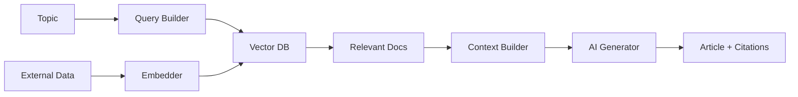

# ADR-0001: Use RAG for Enhanced Article Generation

## Status

Proposed

## Context

The current article generation system relies solely on AI language models with their training data cutoff. This
limits the system's ability to provide up-to-date information and verify facts against current market data. We
need a solution that can:

1. Access real-time cryptocurrency data
2. Verify information against multiple sources
3. Provide citations and references
4. Reduce hallucination in generated content
5. Adapt to rapidly changing market conditions

## Decision

Implement a Retrieval-Augmented Generation (RAG) system that combines:

1. Vector Database: Store and index cryptocurrency news, whitepapers, and market data
2. Embedding Service: Convert content to searchable vectors
3. Retrieval Pipeline: Query relevant information before generation
4. Context Injection: Augment prompts with retrieved data
5. Citation System: Track and include sources in articles

## Architecture

## Consequences

### Positive

- Accuracy: Articles based on verified, current information
- Credibility: All claims backed by citations
- Timeliness: Access to latest market developments
- Scalability: Easy to add new data sources
- Compliance: Better fact-checking for regulatory requirements

### Negative

- Complexity: Additional infrastructure required
- Latency: Retrieval adds processing time
- Cost: Vector database and embedding services
- Maintenance: Regular index updates needed
- Storage: Significant data storage requirements

## Mitigation Strategies

1. Implement caching for frequently accessed content
2. Use batch processing for embeddings
3. Set up incremental indexing
4. Monitor retrieval performance metrics
5. Implement fallback to standard generation if RAG fails