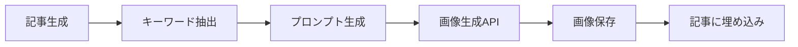

# 追記例：AI画像生成機能

## 🎨 AI画像生成機能（新規追加）

### 概要
記事内容に合わせた画像を自動生成する機能。DALL-E 3やStable Diffusionを使用。

### 技術仕様
- **使用API**: OpenAI DALL-E 3, Stable Diffusion API
- **画像形式**: PNG/JPEG (1024x1024, 512x512)
- **生成タイミング**: 記事生成と同時 or 後処理

### APIエンドポイント
```http
POST /api/articles/{article_id}/generate-images
{
  "count": 3,
  "style": "photorealistic",
  "model": "dall-e-3"
}
```

### ワークフロー


### 設定項目
- 生成枚数制限（デフォルト: 3枚/記事）
- スタイル設定（写実的/イラスト/図表）
- 自動alt text生成

---