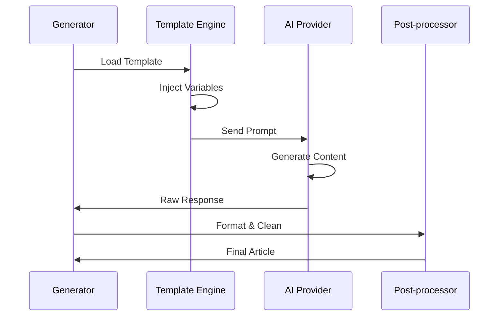

# AI Generator Module

## Overview

The AI generator module (crypto_article_generator_mvp.py) interfaces with multiple AI providers to create
high-quality cryptocurrency articles based on collected topics.

## Public APIs

### CryptoArticleGenerator Class

```python
class CryptoArticleGenerator:
    def __init__(self, api_key: str, ai_provider: str = "openai")
    def generate_article(self, topic: Topic, config: ArticleConfig) -> GeneratedArticle
    def generate_with_template(self, template: AITemplate, data: Dict) -> str
    def estimate_tokens(self, topic: Topic, config: ArticleConfig) -> int
```

### Article Types

```python
class ArticleType(Enum):
    BREAKING_NEWS = "breaking_news"      # 300-500 words
    PRICE_ANALYSIS = "price_analysis"    # 600-1000 words
    TECHNICAL_ANALYSIS = "tech_analysis" # 800-1200 words
    PROJECT_UPDATE = "project_update"    # 500-800 words
    EDUCATIONAL = "educational"          # 1000-1500 words
    MARKET_OVERVIEW = "market_overview"  # 600-1000 words
```

## Data Flow



## External Dependencies

- openai: GPT-4 API client
- google.generativeai: Gemini API client
- tiktoken: Token counting
- markdown: Markdown processing
- jinja2: Template engine

## Generation Features

### Templates

- Dynamic prompt construction
- Variable injection
- Multi-language support ready
- SEO optimization hints

### Quality Controls

- Token limit management
- Content structure validation
- Fact-checking integration points
- Readability scoring

## TODOs & Known Gaps

- Implement Claude API support
- Add custom fine-tuned model support
- Create template marketplace
- Implement content style learning
- Add image generation integration
- Enhance SEO metadata generation