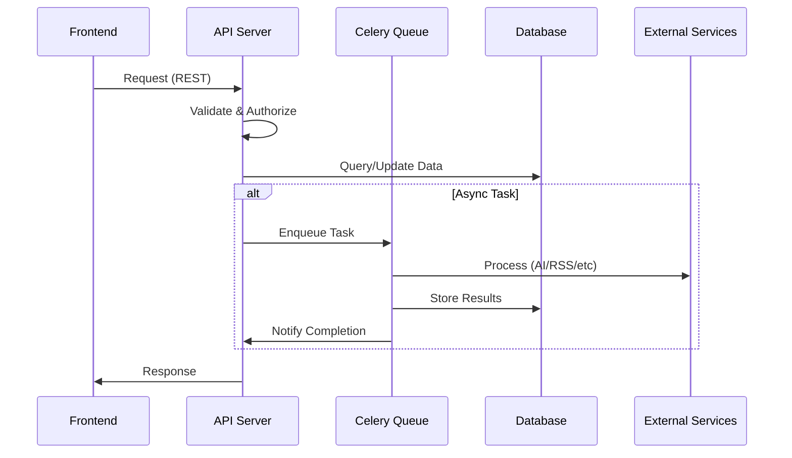

# API Server Module

## Overview

The API server (api_server.py) is the central FastAPI application that provides REST endpoints for the
frontend and orchestrates backend services.

## Public APIs

### System Management

- GET /api/system/stats - Returns system statistics (topics, articles, performance)
- POST /api/system/control - Start/stop system operations
- GET /api/system/health - Health check endpoint

### Topic Management

- GET /api/topics - List topics with filtering and pagination
- GET /api/topics/{id} - Get specific topic details
- PUT /api/topics/{id} - Update topic priority/status
- DELETE /api/topics/{id} - Remove topic
- POST /api/topics/collect - Trigger manual topic collection

### Article Operations

- GET /api/articles - List generated articles
- POST /api/articles/generate - Generate new article from topic
- GET /api/articles/{id} - Retrieve article content
- PUT /api/articles/{id} - Update article content
- DELETE /api/articles/{id} - Delete article
- POST /api/articles/{id}/publish - Publish to WordPress

### Configuration

- GET /api/settings/config - Get current configuration
- POST /api/settings/config - Update API keys and settings
- POST /api/settings/test-connection - Test external API connections
- GET /api/secure-config - Get encrypted configuration
- POST /api/secure-config - Update encrypted settings

### Source Management

- GET /api/sources - List data sources
- POST /api/sources - Add new source
- PUT /api/sources/{id} - Update source configuration
- DELETE /api/sources/{id} - Remove source
- POST /api/sources/test - Test source connectivity

## Data Flow

## External Dependencies

- FastAPI: Web framework
- SQLAlchemy: ORM for database operations
- Pydantic: Data validation
- python-jose: JWT token handling
- httpx: Async HTTP client
- celery: Task queue integration

## TODOs & Known Gaps

- Implement rate limiting per API key
- Add GraphQL endpoint for complex queries
- Enhance WebSocket support for real-time subscriptions
- Implement request/response caching layer
- Add OpenTelemetry instrumentation
- Create API versioning strategy