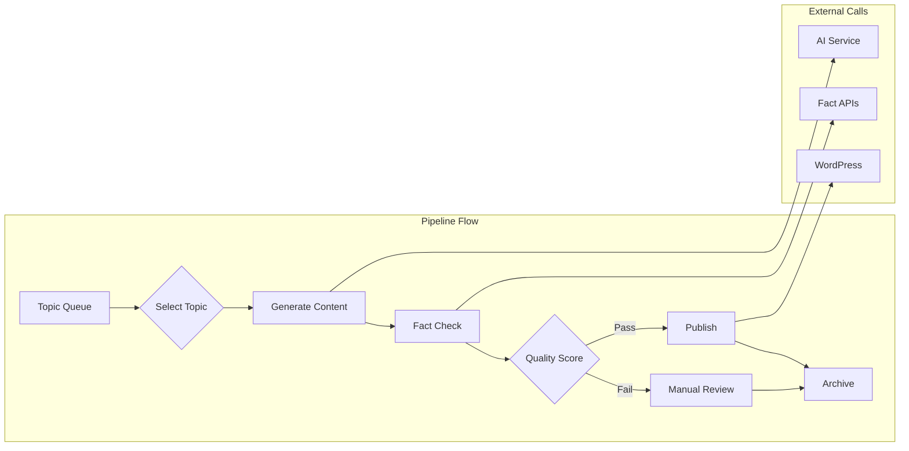

# Article Pipeline Module

## Overview

The article pipeline (article_pipeline.py) orchestrates the complete flow from topic discovery to WordPress
publication, managing the lifecycle of article generation.

## Public APIs

### Main Pipeline Class

```python
class ArticlePipeline:
    def __init__(self, config: Dict[str, Any])
    async def run_pipeline(self, topic_id: str = None) -> PipelineResult
    async def generate_single_article(self, topic: Topic, params: GenerationParams) -> Article
    def get_pipeline_status(self) -> PipelineStatus
```

## Pipeline Stages

1. Topic Selection: Prioritize topics based on relevance and recency
2. Content Generation: AI-powered article creation
3. Fact Checking: Verify claims and data accuracy
4. Quality Scoring: Evaluate content quality
5. Publishing: WordPress submission

## Data Flow



## External Dependencies

- topic_collector: Source of topics
- crypto_article_generator_mvp: AI generation engine
- fact_checker: Content verification
- content_scorer: Quality assessment
- wordpress_publisher: Publishing interface
- celery: Async task execution

## TODOs & Known Gaps

- Implement retry mechanism for failed stages
- Add A/B testing for different generation strategies
- Create pipeline analytics dashboard
- Implement content versioning
- Add multi-language pipeline support
- Enhance error recovery mechanisms