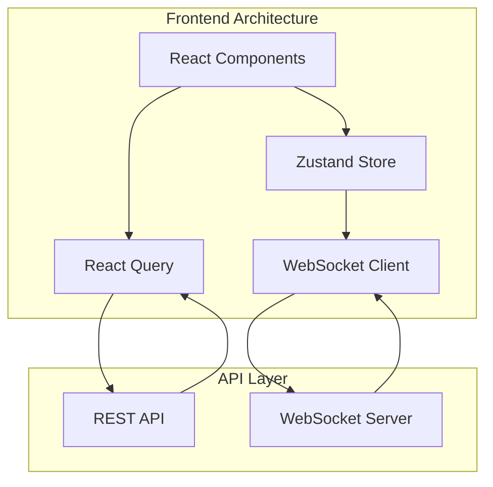

# Frontend Architecture Module

## Overview

The Next.js frontend provides a modern, responsive interface for managing the crypto article system, built with
TypeScript and React.

## Public APIs

API Client (src/lib/api.ts)

```typescript
class APIClient {
  async getTopics(filters?: TopicFilters): Promise<Topic[]>
  async generateArticle(params: GenerateParams): Promise<Article>
  async publishArticle(id: string): Promise<PublishResult>
  async updateSettings(settings: SystemSettings): Promise<void>
}
```

## Key Hooks

```typescript
// Real-time updates
useWebSocket(url: string, handlers: WSHandlers): WSConnection

// Data fetching
useTopics(filters?: TopicFilters): TopicsResult
useArticles(status?: ArticleStatus): ArticlesResult

// System monitoring  
useSystemStats(): SystemStats
usePerformanceMetrics(): PerformanceData
```

## Data Flow



## External Dependencies

- next: React framework
- @tanstack/react-query: Data fetching
- zustand: State management
- socket.io-client: WebSocket connection
- @radix-ui: UI components
- tailwindcss: Styling
- zod: Runtime validation

## Component Structure

### Main Layout

- Dashboard with 4 primary tabs
- Settings with 6 sub-tabs
- Responsive sidebar navigation
- Real-time notification system

### Key Features

- Dark theme optimized
- Keyboard shortcuts
- Drag-and-drop interfaces
- Real-time data updates
- Progressive enhancement

## TODOs & Known Gaps

- Implement offline support with PWA
- Add internationalization (i18n)
- Create component documentation
- Implement E2E testing suite
- Add analytics integration
- Enhance accessibility compliance