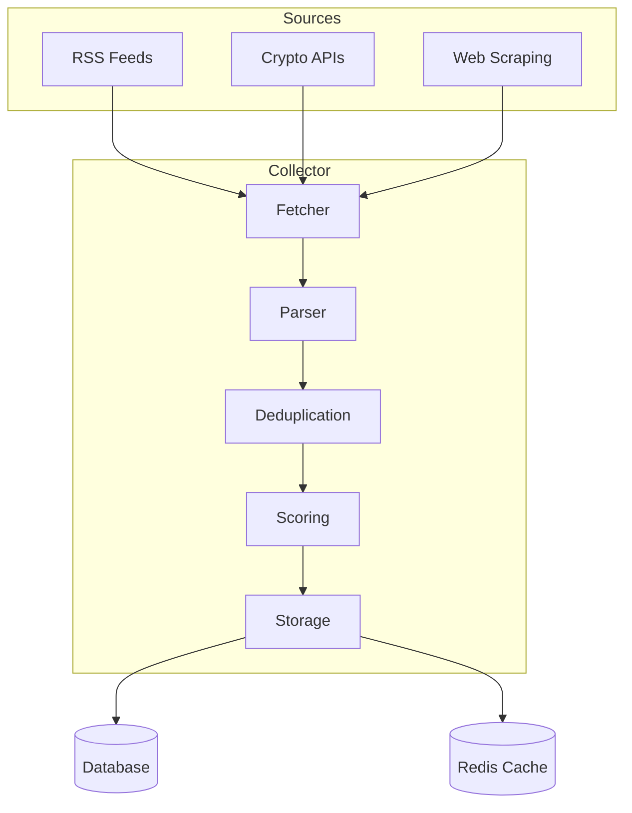

# Topic Collector Module

## Overview

The topic collector (topic_collector.py) aggregates cryptocurrency news and trends from multiple sources,
providing a prioritized feed of potential article topics.

## Public APIs

### TopicCollector Class

```python
class TopicCollector:
    def collect_all_topics(self) -> List[CollectedTopic]
    def add_source(self, source: DataSource) -> bool
    def remove_source(self, source_id: str) -> bool
    def get_topic_by_id(self, topic_id: str) -> Optional[CollectedTopic]
    def update_topic_priority(self, topic_id: str, priority: int) -> bool
```

### Data Models

```python
@dataclass
class CollectedTopic:
    id: str
    title: str
    description: str
    source: str
    source_url: str
    priority: int
    collected_at: datetime
    category: TopicCategory
    metadata: Dict[str, Any]
```

## Data Flow



## External Dependencies

- feedparser: RSS feed parsing
- httpx: Async HTTP requests
- beautifulsoup4: HTML parsing
- redis: Caching layer
- sqlalchemy: Database operations

## Configured Sources

### RSS Feeds

- CoinTelegraph, CoinDesk, Decrypt (International)
- CoinPost, Crypto Watch (Japanese)

### APIs

- CoinGecko: Price movements
- CoinMarketCap: Market trends
- Custom webhooks: Breaking news

## TODOs & Known Gaps

- Implement ML-based topic relevance scoring
- Add Twitter/X API integration
- Create source health monitoring
- Implement topic clustering to avoid duplicates
- Add support for podcast/video sources
- Enhance multilingual topic extraction