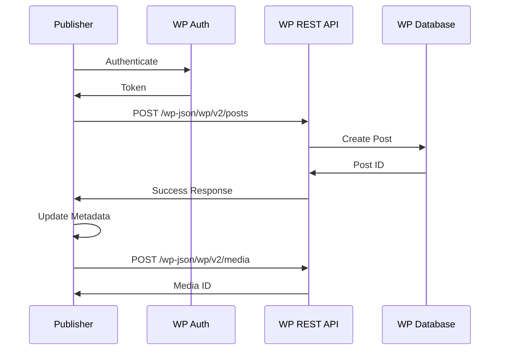

# WordPress Publisher Module

## Overview

The WordPress publisher (wordpress_publisher.py) handles automated posting of generated articles to WordPress
sites via REST API.

## Public APIs

### WordPressPublisher Class

```python
class WordPressPublisher:
    def __init__(self, site_url: str, username: str, app_password: str)
    def create_post(self, article: Article, status: str = "draft") -> PostResult
    def update_post(self, post_id: int, article: Article) -> PostResult
    def delete_post(self, post_id: int) -> bool
    def get_post_status(self, post_id: int) -> PostStatus
    def test_connection(self) -> ConnectionTest
```

### Post Configuration

```python
@dataclass
class PostConfig:
    status: str = "draft"  # draft, publish, private
    categories: List[int] = field(default_factory=list)
    tags: List[int] = field(default_factory=list)
    featured_media: Optional[int] = None
    excerpt: Optional[str] = None
    meta: Dict[str, Any] = field(default_factory=dict)
```

## Data Flow



## External Dependencies

- requests: HTTP client
- python-wordpress-xmlrpc: Legacy support
- beautifulsoup4: HTML processing
- pillow: Image handling

## WordPress Integration

### Authentication

- Application passwords (recommended)
- Basic auth (legacy)
- OAuth 2.0 (planned)

### Features

- Draft/Publish control
- Category/Tag management
- Featured image upload
- Custom field support
- SEO plugin integration

## TODOs & Known Gaps

- Implement bulk publishing
- Add Gutenberg block support
- Create revision management
- Implement scheduled posting
- Add multi-site support
- Enhance media library integration