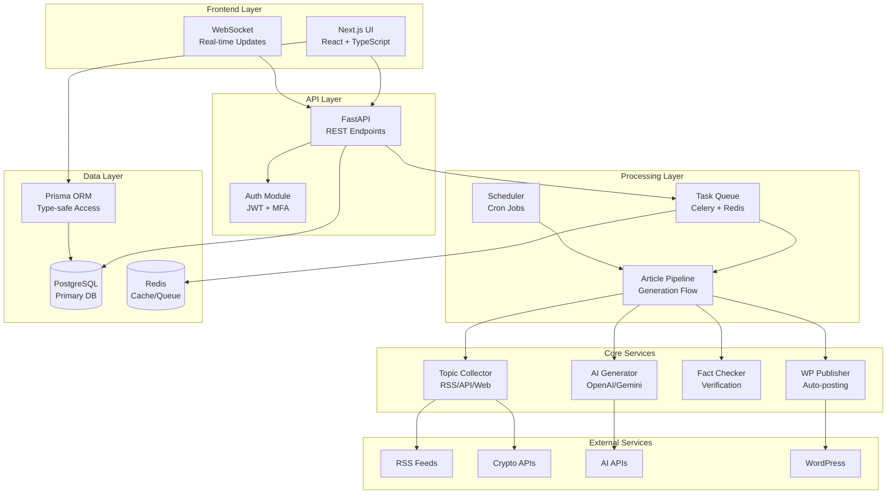

# Crypto Article System Overview

## Purpose & High-Level Architecture

The Crypto Article System is an AI-driven platform for automated cryptocurrency article generation,
designed to collect trending topics, generate high-quality content, and publish to WordPress
automatically.

## Major Tech Choices

- Next.js 15 + TypeScript: Modern React framework with App Router for optimal performance and SEO
- FastAPI + Python 3.12: High-performance async API framework with automatic OpenAPI documentation
- PostgreSQL + Prisma: Robust relational database with type-safe ORM for data integrity
- Celery + Redis: Distributed task queue for scalable async processing
- Docker + Docker Compose: Containerized deployment for consistent environments
- Tailwind CSS + Radix UI: Utility-first styling with accessible component library
- OpenAI GPT-4 / Gemini: Multiple AI providers for flexible article generation
- Socket.io + BullMQ: Real-time updates and reliable job processing

## System Boundaries

### What IS Covered

- Automated topic collection from cryptocurrency news sources
- AI-powered article generation with multiple templates
- Multi-tenant organization support with role-based access
- Fact-checking and content scoring
- Automated WordPress publishing
- Real-time monitoring and analytics
- Comprehensive security with MFA and audit logging

### What is NOT Covered

- Direct trading or financial advice functionality
- Personal wallet management
- Blockchain interaction or smart contract deployment
- User-generated content moderation
- Multi-language support (currently Japanese/English only)
- Mobile native applications
- Third-party plugin development framework