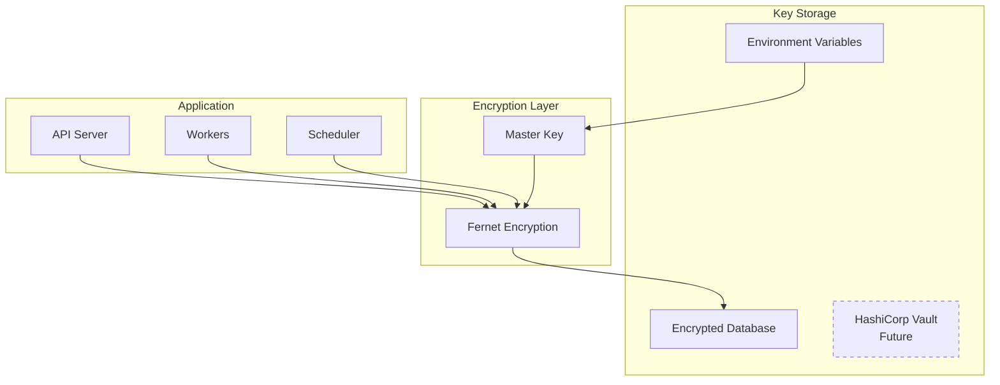

# Security Documentation

## Key Management Flow



## Key Rotation Process

1. Generate new master key
2. Decrypt all secrets with old key
3. Re-encrypt with new key
4. Update key in secure storage
5. Verify all services can decrypt
6. Safely destroy old key

## OWASP Top-10 Coverage Matrix

| Risk                           | Mitigation                                     | Implementation                        |
|--------------------------------|------------------------------------------------|---------------------------------------|
| A01: Broken Access Control     | RBAC, JWT tokens, API key scoping              | auth_permissions.py, Prisma policies  |
| A02: Cryptographic Failures    | Fernet encryption, TLS 1.3, secure key storage | config_manager.py, nginx config       |
| A03: Injection                 | Parameterized queries, input validation        | SQLAlchemy ORM, Pydantic models       |
| A04: Insecure Design           | Threat modeling, security reviews              | Architecture docs, code reviews       |
| A05: Security Misconfiguration | Hardened Docker images, least privilege        | docker-compose.yml, IAM policies      |
| A06: Vulnerable Components     | Dependabot, regular updates                    | GitHub security scanning              |
| A07: Auth Failures             | MFA, strong passwords, session management      | auth_mfa.py, bcrypt hashing          |
| A08: Software & Data Integrity | Code signing, integrity checks                 | CI/CD pipeline, checksums            |
| A09: Security Logging          | Comprehensive audit logs, monitoring           | SecurityAuditLog model, Prometheus    |
| A10: SSRF                      | URL validation, allowlists                     | external_apis/ validators            |

## Security Controls

### Authentication & Authorization

- Multi-Factor Authentication: TOTP-based 2FA
- Session Management: Redis-backed with expiry
- API Keys: Scoped permissions, rotation support
- Password Policy: Min 12 chars, complexity requirements

### Data Protection

- Encryption at Rest: AES-256 via Fernet
- Encryption in Transit: TLS 1.3 only
- PII Handling: Automated detection and masking
- Backup Encryption: GPG-encrypted archives

### Network Security

- Rate Limiting: Per-IP and per-user limits
- DDoS Protection: Cloudflare integration ready
- CORS Policy: Strict origin validation
- CSP Headers: Restrictive content policies

### Monitoring & Incident Response

- Security Events: Real-time alerting
- Anomaly Detection: ML-based behavior analysis
- Incident Playbooks: Documented procedures
- Forensic Logging: Immutable audit trail

## Vulnerability Disclosure

### Reporting Security Issues

Please report security vulnerabilities to:

Email: security@crypto-article-system.com

PGP Key:
```
-----BEGIN PGP PUBLIC KEY BLOCK-----
[Public key would be inserted here]
-----END PGP PUBLIC KEY BLOCK-----
```

### Response Timeline

- Acknowledgment: Within 24 hours
- Initial Assessment: Within 72 hours
- Fix Timeline: Based on severity
  - Critical: 24-48 hours
  - High: 1 week
  - Medium: 2 weeks
  - Low: Next release

### Scope

We welcome reports on:
- Authentication bypasses
- Data exposure
- Injection vulnerabilities
- Logic flaws
- Configuration issues

Out of scope:
- Social engineering
- Physical attacks
- Third-party services
- Recently disclosed 0-days (< 30 days)

## Security Checklist

### Deployment

- All secrets in environment variables
- Database passwords rotated
- API keys have minimal permissions
- Firewall rules configured
- SSL certificates valid
- Security headers enabled

### Monitoring

- Log aggregation configured
- Alerts set up for failures
- Audit logs enabled
- Backup verification scheduled
- Penetration test scheduled

### Compliance

- Data retention policies defined
- GDPR compliance verified
- Terms of service updated
- Privacy policy published
- Security training completed