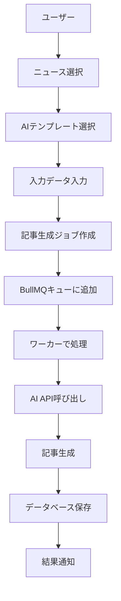

# 記事生成フロー Documentation

## 概要

暗号通貨記事自動生成システムの記事生成フローを詳しく説明します。このシステムは、RSSニュースからAIを使用して高品質な記事を自動生成する機能を提供します。

## システム全体構成

```
┌─────────────────┐    ┌─────────────────┐    ┌─────────────────┐
│   フロントエンド  │    │   API Routes    │    │   BullMQ Queue  │
│   (Next.js)     │────│   (Next.js)     │────│   (Redis)       │
└─────────────────┘    └─────────────────┘    └─────────────────┘
                                                        │
                                                        ▼
                                                ┌─────────────────┐
                                                │   AI Provider   │
                                                │   (Gemini/GPT)  │
                                                └─────────────────┘
```

## 1. 記事生成フロー全体

### 1.1 フロー概要


### 1.2 主要コンポーネント

#### フロントエンド
- **`SecureArticleGenerationForm.tsx`**: メインの記事生成フォーム
- **`useCSRF.ts`**: CSRF保護フック
- **`useInputSanitizer.ts`**: 入力サニタイズフック

#### バックエンド
- **`/api/ai/jobs/route.ts`**: ジョブ管理API
- **`/api/ai/templates/route.ts`**: テンプレート管理API
- **`article-generator.ts`**: 記事生成ワーカー
- **`queue.ts`**: セキュアキューシステム

## 2. AIテンプレートシステム

### 2.1 テンプレート構造

```typescript
interface AITemplate {
  id: string
  name: string
  description?: string
  category?: string
  systemPrompt: string         // AI の役割と指示
  userPrompt: string          // ユーザープロンプト（変数含む）
  fewShotExamples?: Array<{   // 学習用例文
    input: string
    output: string
  }>
  variables?: Record<string, any>  // 変数定義
  aiProvider: 'OPENAI' | 'CLAUDE' | 'GEMINI'
  model: string
  temperature: number
  maxTokens: number
  usageCount: number
  successRate: number
  isActive: boolean
  isPublic: boolean
}
```

### 2.2 デフォルトテンプレート

#### 1. 暗号通貨ニュース記事生成
```typescript
{
  name: "暗号通貨ニュース記事生成",
  category: "cryptocurrency",
  aiProvider: "GEMINI",
  model: "gemini-1.5-pro",
  temperature: 0.3,
  maxTokens: 2000,
  systemPrompt: `
    あなたは暗号通貨とブロックチェーン技術の専門ライターです。
    提供されたニュース情報をもとに、以下の要件を満たす記事を作成してください：
    
    1. 技術的な正確性を保つ
    2. 初心者にも理解しやすい説明を含める
    3. 市場への影響を分析する
    4. 客観的で偏りのない視点を維持する
    5. SEO を意識したタイトルと構成にする
  `,
  userPrompt: `
    以下のニュース情報をもとに、暗号通貨記事を作成してください：
    
    タイトル: {{title}}
    要約: {{summary}}
    内容: {{content}}
    ソース: {{source}}
    関連通貨: {{coins}}
    重要度: {{importance}}
    センチメント: {{sentiment}}
    公開日: {{publishedAt}}
    
    記事の構成:
    1. 魅力的なタイトル
    2. 要約（2-3文）
    3. 詳細な本文（1000-1500文字）
    4. 市場分析
    5. まとめ
  `
}
```

### 2.3 変数システム

#### 利用可能な変数
- `{{title}}`: ニュースタイトル
- `{{summary}}`: 要約
- `{{content}}`: 本文
- `{{source}}`: ソース
- `{{coins}}`: 関連通貨
- `{{importance}}`: 重要度 (1-10)
- `{{sentiment}}`: センチメント (-1 to 1)
- `{{publishedAt}}`: 公開日時

#### 変数置換処理
```typescript
let finalPrompt = template.userPrompt
for (const [key, value] of Object.entries(inputData)) {
  const placeholder = `{{${key}}}`
  finalPrompt = finalPrompt.replace(new RegExp(placeholder, 'g'), String(value))
}
```

## 3. 記事生成プロセス詳細

### 3.1 Step 1: ニュース選択
```typescript
// ニュース一覧取得
const newsItems = await fetch('/api/news')
  .then(res => res.json())

// ニュース選択
const selectedNews = newsItems.find(item => item.id === selectedId)
```

### 3.2 Step 2: テンプレート選択
```typescript
// テンプレート一覧取得
const templates = await fetch('/api/ai/templates')
  .then(res => res.json())

// テンプレート選択とプレビュー
const selectedTemplate = templates.find(t => t.id === templateId)
```

### 3.3 Step 3: 入力データ準備
```typescript
// 入力データの準備（サニタイズ済み）
const inputData = {
  newsId: selectedNews.id,
  title: sanitizeInput(selectedNews.title),
  summary: sanitizeInput(selectedNews.summary || ''),
  content: sanitizeInput(selectedNews.content || ''),
  source: sanitizeInput(selectedNews.source),
  url: selectedNews.url,
  topics: selectedNews.topics || [],
  coins: selectedNews.coins || [],
  sentiment: selectedNews.sentiment,
  importance: selectedNews.importance,
  publishedAt: selectedNews.publishedAt
}
```

### 3.4 Step 4: ジョブ作成
```typescript
// CSRF保護付きジョブ作成
const response = await fetch('/api/ai/jobs', {
  method: 'POST',
  headers: {
    'Content-Type': 'application/json',
    'X-CSRF-Token': csrfToken
  },
  body: JSON.stringify({
    templateId: selectedTemplateId,
    inputData,
    priority: selectedNews.importance >= 8 ? 100 : 50
  })
})
```

### 3.5 Step 5: キューイング
```typescript
// BullMQキューにジョブを追加
const { addSecureJob } = await import('@/lib/queue')
await addSecureJob(user.organizationId, job.id, job.priority)
```

### 3.6 Step 6: ワーカー処理
```typescript
// 記事生成ワーカー
export const articleGeneratorWorker = async (job) => {
  const { jobId, organizationId } = job.data
  
  // 1. プロンプト構築
  const prompt = buildPrompt(template, inputData)
  
  // 2. AI API呼び出し
  const aiProvider = AIProviderFactory.createProvider(
    template.aiProvider,
    providerConfig
  )
  
  const result = await aiProvider.generateArticle(prompt, {
    temperature: template.temperature,
    maxTokens: template.maxTokens
  })
  
  // 3. 結果保存
  await saveArticle(result, jobId)
  
  // 4. 通知
  await notifyCompletion(jobId)
}
```

## 4. セキュリティ機能

### 4.1 CSRF保護
```typescript
// Double Submit Token方式
export function generateDoubleSubmitToken(sessionId: string): string {
  const timestamp = Date.now().toString()
  const randomValue = randomBytes(16).toString('hex')
  const payload = `${sessionId}:${timestamp}:${randomValue}`
  const token = createHmac('sha256', process.env.CSRF_SECRET)
    .update(payload)
    .digest('hex')
  return `${timestamp}.${randomValue}.${token}`
}
```

### 4.2 入力サニタイゼーション
```typescript
export function sanitizeInput(input: string): string {
  return input
    .replace(/<script\b[^<]*(?:(?!<\/script>)<[^<]*)*<\/script>/gi, '')
    .replace(/<[^>]*>/g, '')
    .replace(/javascript:/gi, '')
    .replace(/on\w+\s*=\s*"[^"]*"/gi, '')
    .trim()
}
```

### 4.3 プロンプトインジェクション対策
```typescript
const suspiciousPatterns = [
  /ignore\s+previous\s+instructions/i,
  /system\s*:\s*you\s+are/i,
  /\[SYSTEM\]/i,
  /forget\s+everything/i,
  /new\s+instructions/i
]

const suspiciousContent = suspiciousPatterns.some(pattern => 
  pattern.test(promptText)
)
```

### 4.4 レート制限
```typescript
// API レート制限
const rateLimitResult = await rateLimit(
  request, 
  'ai-jobs-create', 
  30,        // 30回
  60000      // 1分間
)
```

## 5. エラーハンドリング

### 5.1 ジョブ失敗処理
```typescript
// ジョブの失敗処理
if (job.status === 'FAILED') {
  await createSecurityAuditLog({
    organizationId: user.organizationId,
    userId: user.userId,
    eventType: 'JOB_FAILED',
    severity: 'warning',
    description: `Article generation job failed: ${job.errorMessage}`,
    resourceId: job.id,
    resourceType: 'ArticleGenerationJob'
  })
}
```

### 5.2 AI API エラー処理
```typescript
try {
  const result = await aiProvider.generateArticle(prompt, options)
  return result
} catch (error) {
  if (error.code === 'RATE_LIMIT_EXCEEDED') {
    throw new Error('Rate limit exceeded. Please try again later.')
  } else if (error.code === 'INVALID_API_KEY') {
    throw new Error('Invalid API key. Please check your configuration.')
  } else {
    throw new Error(`AI generation failed: ${error.message}`)
  }
}
```

## 6. 監視とログ

### 6.1 セキュリティ監査ログ
```typescript
await createSecurityAuditLog({
  organizationId: user.organizationId,
  userId: user.userId,
  eventType: 'JOB_CREATED',
  severity: 'info',
  description: `Article generation job created with template: ${template.name}`,
  resourceId: job.id,
  resourceType: 'ArticleGenerationJob',
  metadata: {
    templateId: template.id,
    templateName: template.name,
    priority: job.priority,
    inputDataKeys: Object.keys(inputData)
  }
})
```

### 6.2 パフォーマンス監視
```typescript
// 処理時間の記録
const startTime = Date.now()
const result = await processArticleGeneration(job)
const processingTime = Date.now() - startTime

await updateJobMetrics(job.id, {
  processingTime,
  tokensUsed: result.tokensUsed,
  costEstimate: result.costEstimate
})
```

## 7. 開発・デバッグ情報

### 7.1 開発環境設定
```bash
# 環境変数設定
NODE_ENV=development
JWT_SECRET=your-secret-key
CSRF_SECRET=your-csrf-secret
ENCRYPTION_KEY=your-encryption-key

# Gemini API設定
GEMINI_API_KEY=your-gemini-api-key
```

### 7.2 デバッグログ
```typescript
// 開発環境でのデバッグログ
if (process.env.NODE_ENV === 'development') {
  console.log('[DEBUG] Job created:', job.id)
  console.log('[DEBUG] Template:', template.name)
  console.log('[DEBUG] Input data:', inputData)
}
```

## 8. トラブルシューティング

### 8.1 よくある問題

#### CSRFトークンエラー
```
問題: "CSRFトークンの検証に失敗しました"
解決: NODE_ENV=development を .env.local に追加
```

#### AIテンプレートが見つからない
```
問題: "Template not found or inactive"
解決: npm run create-default-templates を実行
```

#### API キーエラー
```
問題: "Invalid API key"
解決: scripts/setup-gemini-api.ts を実行してAPIキーを設定
```

### 8.2 ログ確認コマンド
```bash
# アプリケーションログ
tail -f logs/combined.log

# Next.js ログ
tail -f logs/nextjs.log

# エラーログ
tail -f logs/error.log
```

## 9. 今後の拡張計画

### 9.1 Phase 5: セキュリティ監視ダッシュボード
- リアルタイムセキュリティ監視
- 異常検知アラート
- 詳細な監査ログ分析

### 9.2 Phase 6: ジョブ監視システム
- ジョブ実行状況の可視化
- パフォーマンス分析
- 自動スケーリング

## 10. 参考資料

- [Next.js Documentation](https://nextjs.org/docs)
- [BullMQ Documentation](https://docs.bullmq.io/)
- [Prisma Documentation](https://www.prisma.io/docs)
- [Gemini API Documentation](https://ai.google.dev/docs)

---

**最終更新**: 2025-07-15
**バージョン**: 1.0.0
**作成者**: Claude Code Assistant